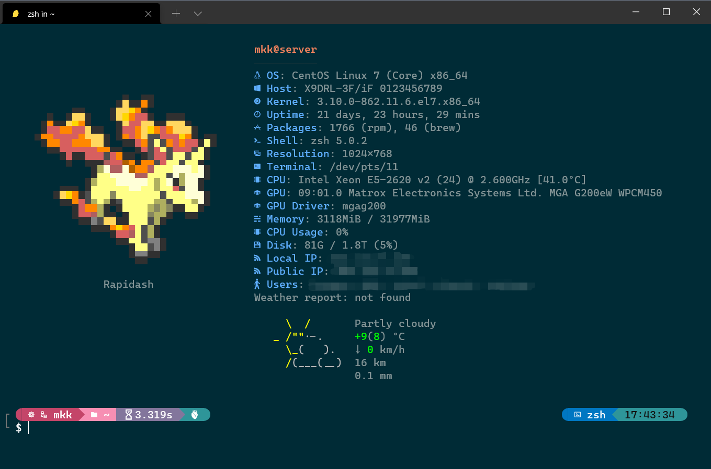

# pokemonfetch
A command-line system information tool.



Pokemonfetch displays information about your operating system, software and hardware in an aesthetic and visually pleasing way, which combining the characteristics of both [neofetch](https://github.com/dylanaraps/neofetch) and [pokemonsay](https://github.com/possatti/pokemonsay), the code is modified on the basis of neofetch and pokémon images are from pokemonsay.

### Requirement
- `CaskaydiaCove Nerd Font` to show some glyphs. [link](https://github.com/ryanoasis/nerd-fonts/releases/download/v2.1.0/CascadiaCode.zip)

### Installation

```bash
git clone git@github.com:Urinx/pokemonfetch.git -O ~/.pokemonfetch
chmod +x ~/.pokemonfetch/pokemonfetch
cp ~/.pokemonfetch/pokemonfetch ~/bin/
```
Then you can use this command anywhere, no parameter options can be provided, please modify the code directly if you want to customize.
```bash
pokemonfetch
```
